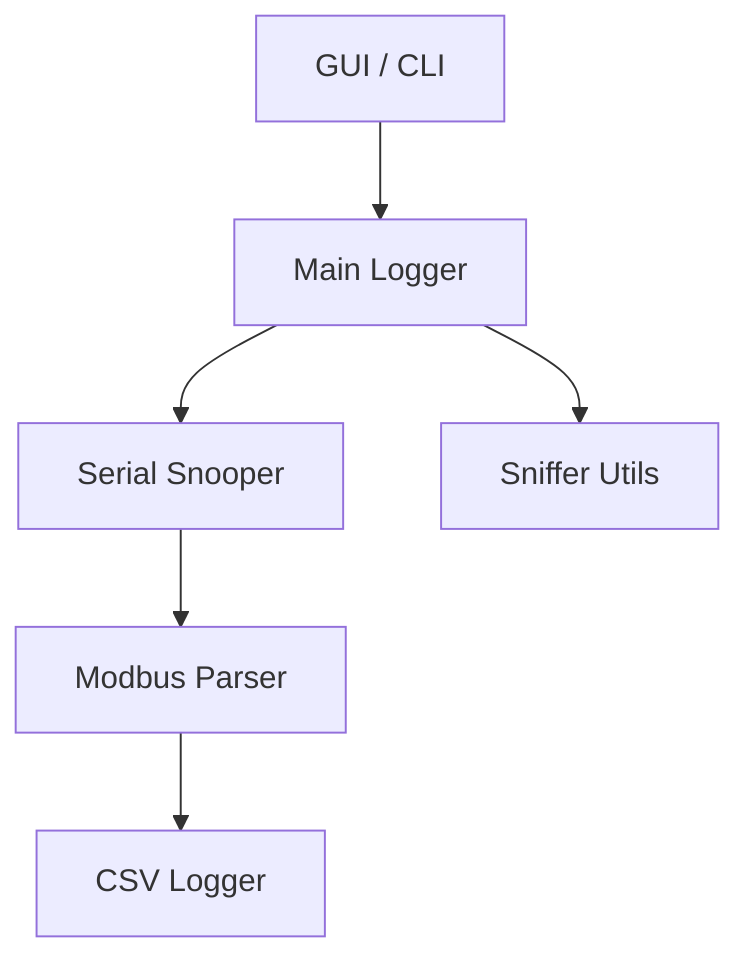

# ModbusSniffer

<table style="width: 100%; border: none;">
  <tr>
    <td style="width: 160px; vertical-align: top;">
      
    </td>
    <td style="vertical-align: top; font-size: 0.9rem; font-family: system-ui, sans-serif; position: relative;">
      <div style="margin-bottom: 1.5em;">
        <strong>ModbusSniffer</strong> is a lightweight, cross-platform desktop application for monitoring Modbus RTU communication via serial ports in real-time.<br><br>
        Designed for engineers, technicians, and automation developers, it simplifies troubleshooting by capturing and showing decoded Modbus traffic in real-time.
      </div>
      <div style="text-align: right;">
        <a href="https://github.com/niwciu/ModbusSniffer/releases">
          
        </a>
      </div>
    </td>
  </tr>
</table>


<div align="center">
  
  <p><em>Live preview of ModbusSniffer GUI in action</em></p>
</div>

---

## 🚀 Key Features

- ✅ Real-time Modbus RTU frame capturing
- ✅ Live Frame table view
- ✅ Friendly graphical interface (PyQt6)
- ✅ Message decoding with function and address information
- ✅ Filtering, sorting and searching captured data
- ✅ Exporting logs to txt and CSV
- ✅ Sniffs raw Modbus RTU frames from serial ports (RS-485, USB)
- ✅ Color-coded logging of request–response frames in terminal view
- ✅ Cross-platform: Windows & Linux
- ✅ MIT licensed, open-source

---

## 📥 Download & Installation


Download binary files for Ubuntu and Windows from [GitHub Releases](https://github.com/niwciu/ModbusSniffer/releases).

You can also install directly from pip or build and install the app from sources. [Click here](installation.md) for details.

---

## 🖥️ User Interface Overview

The graphical interface of ModbusSniffer is designed for clarity and usability. It consists of:

- **Top Toolbar**  
  Controls for connecting to a serial port, starting/stopping sniffing, and additional options such as logging to file or exporting logs to CSV.

- **Main Display Area**  
  Two switchable views:
  - **Table View**: Displays Modbus requests and responses in real time, with sortable columns.
  - **Console View**: A terminal-like display with color-coded request–response pairs, useful for quick scanning and debugging.

- **Filters Panel**  
  Allows filtering captured traffic by device ID, function code, or register address to focus on specific devices or operations (currently under development).


---

## 📚 How It Works

ModbusSniffer opens a serial port and passively listens to the incoming data stream. It continuously scans the raw byte stream for valid Modbus RTU frames using protocol-specific timing and structure rules.

Each detected frame is decoded to extract key information such as device address, function code, and data content.

Depending on the selected mode and view:

- In the GUI, frames can be:

  - displayed in a real-time tabular view with sorting and filtering options, or

  - shown in a terminal-like log view where each request–response pair is grouped and color-coded. Alternating colors help visually separate transactions, and invalid or unanswered frames are highlighted in red.

- In the CLI, frames are printed line-by-line to standard output. The format and verbosity of output depend on command-line flags passed by the user.

> ℹ️ Tip: For safe, non-intrusive monitoring of Modbus RTU traffic, use a passive RS-485 tap or a USB-to-RS485 adapter configured to listen-only. This allows ModbusSniffer to capture data without sending or disturbing any signals on the bus.

---

## 🏗️ Architecture

ModbusSniffer is built with a modular architecture for clarity and maintainability. The core components are:



- **GUI/CLI**: User interfaces for starting/stopping sniffing and displaying results.
- **Main Logger**: Coordinates logging and data flow.
- **Serial Snooper**: Handles serial port communication and raw data capture.
- **Modbus Parser**: Decodes Modbus RTU frames into readable format.
- **CSV Logger**: Exports data to CSV for analysis.
- **Sniffer Utils**: Utility functions for data processing.

---

## ❓ FAQ

**Q: Can I use ModbusSniffer with USB-to-RS485 converters?**  
Yes! ModbusSniffer works out of the box with any USB-to-RS485 converter that exposes a standard COM port.

**Q: Is it safe to use ModbusSniffer on a live Modbus bus?**  
Absolutely. The application is passive — it only listens and does not transmit any data, so it won’t interfere with normal communication.

**Q: Can I decode custom or proprietary Modbus function codes?**  
Not yet. Support for custom function code decoding is planned for a future release.

**Q: How can I run ModbusSniffer?**  
The easiest way is to download the pre-built binaries from the [releases page](https://github.com/niwciu/ModbusSniffer/releases) run the app.  
You can also install it via PyPI.
Alternatively, You can clone the repository and run the script manually or run build&install script inside the repo.  
For quick guide look at [Usage](#usage) section.  
For more information albut build & install can be found [here](installation.md)

**Q: Is there an installer that adds ModbusSniffer to system programs with shortcuts and icons?**  
No, there is no official installer package. However, by following the instructions in the Installation guide, you can clone the repository and run the build script. This script compiles the application from source, creates binaries, and adds shortcuts to the system pointing to the built binaries.

> ⚠️ Important: The build script generates binaries inside the project folder and creates shortcuts referencing those binaries. It does not modify system files. Therefore, do not delete the binary folder after installation, or shortcuts will stop working.

**Q: What if I encounter errors during installation or usage?**  
Check the [troubleshooting guide](installation.md#troubleshooting) or open an issue on GitHub with details about your setup and error messages.

**Q: Can ModbusSniffer handle high-speed Modbus communication?**  
Yes, it supports baud rates up to 115200 and higher, depending on your hardware. For very high speeds, ensure your serial adapter is capable.

**Q: Is there a way to automate sniffing with scripts?**  
Yes, use the CLI mode in scripts or integrate with Python code via the API.

---

## 📬 Support & Feedback

If you find a bug or have suggestions, [open an issue on GitHub](https://github.com/niwciu/ModbusSniffer/issues).

MIT Licensed. Created by [niwciu](https://github.com/niwciu).

---

## ▶️ Usage

### 🎛️ Running the GUI

**If using a binary (downloaded or built):**  
Just run the app like any other executable — no terminal required.

**If installed via pip:**  
```bash
modbus-sniffer-gui
```

**If running directly from the cloned repository:**  
Navigate to the source folder and run the GUI script:
```bash
cd src/modbus_sniffer
python gui.py
```

---

### 🖥️ Running the CLI

To see all available options:
```bash
modbus-sniffer -h
```

Example: Running the sniffer on `/dev/ttyUSB0` with baud rate `115200` and no parity:
```bash
modbus-sniffer -p /dev/ttyUSB0 -b 115200 -r none
```

For more usage examples, development guide, and instructions for building from source, visit:

👉 [ModbusSniffer on GitHub](https://github.com/niwciu/ModbusSniffer)  
👉 [CONTRIBUTING.md](CONTRIBUTING.md)

## 📋 Examples

### Basic Sniffing
Start GUI, select serial port (e.g., COM3 or /dev/ttyUSB0), set baud rate to 9600, and click "Start". View live frames in the table.

### CLI with Logging
```bash
modbus-sniffer -p /dev/ttyUSB0 -b 115200 -r none --log-file output.csv
```

### Debugging PLC Communication
Use table view to filter by device ID 1, monitor read holding registers (function 3) for troubleshooting.

---

## 🤝 Contributing

We welcome contributions!

If you'd like to improve this project, fix bugs, or add features, check out the development guide:

📄 [CONTRIBUTING.md](CONTRIBUTING.md)

## 📜 License

MIT License — see the [LICENSE](https://github.com/niwciu/ModbusSniffer/blob/main/LICENSE) file for details.  
This project is a fork of [BADAndrea ModbusSniffer](https://github.com/BADAndrea/ModbusSniffer), maintained by **niwciu** with enhancements described above.

---

<div align="center">
  
</div>

--- 