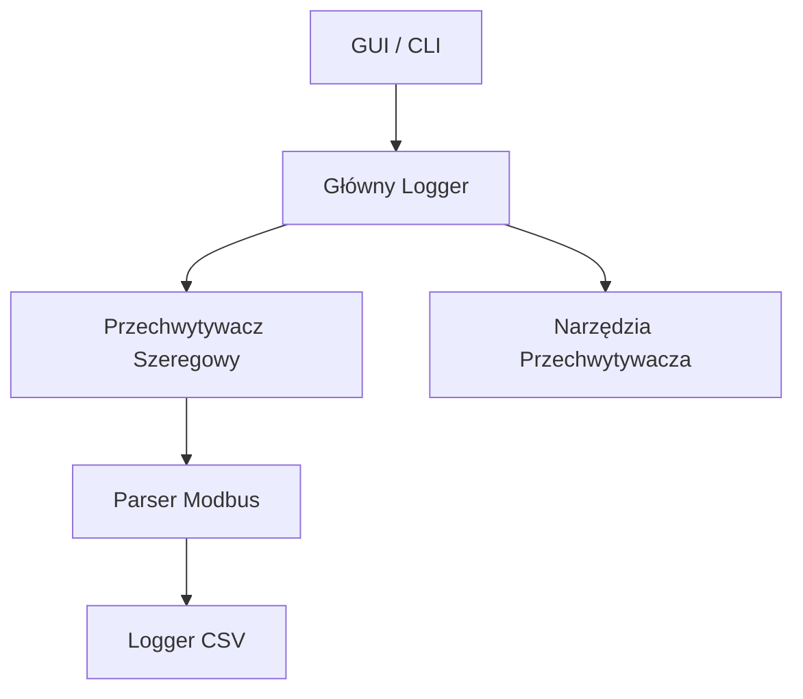

# ModbusSniffer

<table style="width: 100%; border: none;">
  <tr>
    <td style="width: 160px; vertical-align: top;">
      
    </td>
    <td style="vertical-align: top; font-size: 0.9rem; font-family: system-ui, sans-serif; position: relative;">
      <div style="margin-bottom: 1.5em;">
        <strong>ModbusSniffer</strong> to lekkie, wieloplatformowe aplikacja desktopowa do monitorowania komunikacji Modbus RTU przez porty szeregowe w czasie rzeczywistym.<br><br>
        Przeznaczone dla inżynierów, techników i deweloperów automatyki, upraszcza debugowanie poprzez przechwytywanie i dekodowanie ruchu Modbus w czasie rzeczywistym.
      </div>
      <div style="text-align: right;">
        <a href="https://github.com/niwciu/ModbusSniffer/releases">
          
        </a>
      </div>
    </td>
  </tr>
</table>


<div align="center">
  
  <p><em>Podgląd na żywo GUI ModbusSniffer</em></p>
</div>

---

## 🚀 Kluczowe Funkcje

- ✅ Przechwytywanie ramek Modbus RTU w czasie rzeczywistym
- ✅ Widok tabeli ramek na żywo
- ✅ Przyjazny interfejs graficzny (PyQt6)
- ✅ Dekodowanie wiadomości z informacjami o funkcji i adresie
- ✅ Filtrowanie, sortowanie i wyszukiwanie przechwyconych danych
- ✅ Eksport logów do TXT i CSV
- ✅ Przechwytuje surowe ramki Modbus RTU z portów szeregowych (RS-485, USB)
- ✅ Kolorowe logowanie par żądanie-odpowiedź w widoku terminala
- ✅ Wieloplatformowy: Windows & Linux
- ✅ Licencja MIT, open-source

---

## 📥 Pobieranie & Instalacja

Pobierz pliki binarne dla Ubuntu i Windows z [GitHub Releases](https://github.com/niwciu/ModbusSniffer/releases).

Możesz również zainstalować bezpośrednio z PyPI lub zbudować i zainstalować aplikację ze źródeł. [Kliknij tutaj](installation.md) po szczegóły.

---

## 🖥️ Przegląd Interfejsu Użytkownika

Graficzny interfejs ModbusSniffer został zaprojektowany dla przejrzystości i użyteczności. Składa się z:

- **Pasek Narzędzi na Górze**  
  Kontrolki do łączenia się z portem szeregowym, uruchamiania/zatrzymywania przechwytywania i dodatkowych opcji, takich jak logowanie do pliku lub eksport logów do CSV.

- **Główny Obszar Wyświetlania**  
  Dwa przełączalne widoki:
  - **Widok Tabeli**: Wyświetla żądania i odpowiedzi Modbus w czasie rzeczywistym, z kolumnami do sortowania.
  - **Widok Konsoli**: Wyświetlacz podobny do terminala z kodowanymi kolorami parami żądanie-odpowiedź, przydatny do szybkiego skanowania i debugowania.

- **Panel Filtrów**  
  Pozwala filtrować przechwytywany ruch po ID urządzenia, kodzie funkcji lub adresie rejestru, aby skoncentrować się na określonych urządzeniach lub operacjach (aktualnie w opracowaniu).

---

## 📚 Jak To Działa

ModbusSniffer otwiera port szeregowy i pasywnie nasłuchuje przychodzącego strumienia danych. Ciągle skanuje surowy strumień bajtów w poszukiwaniu prawidłowych ramek Modbus RTU, używając specyficznych dla protokołu reguł czasu i struktury.

Każda wykryta ramka jest dekodowana w celu wyciągnięcia kluczowych informacji, takich jak adres urządzenia, kod funkcji i zawartość danych.

W zależności od wybranego trybu i widoku:

- W GUI ramki mogą być:

  - wyświetlane w widoku tabelarycznym w czasie rzeczywistym z opcjami sortowania i filtrowania, lub

  - pokazywane w widoku logu podobnym do terminala, gdzie każda para żądanie-odpowiedź jest grupowana i kodowana kolorami. Naprzemienne kolory pomagają wizualnie oddzielić transakcje, a nieprawidłowe lub nieodpowiedziane ramki są wyróżnione na czerwono.

- W CLI ramki są drukowane linia po linii do standardowego wyjścia. Format i szczegółowość wyjścia zależą od flag wiersza poleceń przekazanych przez użytkownika.

> ℹ️ Wskazówka: Aby bezpiecznie, nieinwazyjnie monitorować ruch Modbus RTU, użyj pasywnego odgałęzienia RS-485 lub adaptera USB-to-RS485 skonfigurowanego tylko do nasłuchiwania. To pozwala ModbusSniffer na przechwytywanie danych bez wysyłania lub zakłócania jakichkolwiek sygnałów na magistrali.

---

## 🏗️ Architektura

ModbusSniffer jest zbudowany z modularną architekturą dla przejrzystości i łatwości utrzymania. Główne komponenty to:



- **GUI/CLI**: Interfejsy użytkownika do uruchamiania/zatrzymywania przechwytywania i wyświetlania wyników.
- **Główny Logger**: Koordynuje logowanie i przepływ danych.
- **Przechwytywacz Szeregowy**: Obsługuje komunikację przez port szeregowy i przechwytywanie surowych danych.
- **Parser Modbus**: Dekoduje ramki Modbus RTU na czytelny format.
- **Logger CSV**: Eksportuje dane do CSV na potrzeby analizy.
- **Narzędzia Przechwytywacza**: Funkcje pomocnicze do przetwarzania danych.

---

## ❓ FAQ

**P: Czy mogę używać ModbusSniffer z konwerterami USB-to-RS485?**  
Tak! ModbusSniffer działa od razu z dowolnym konwerterem USB-to-RS485, który udostępnia standardowy port COM.

**P: Czy bezpieczne jest używanie ModbusSniffer na żywej magistrali Modbus?**  
Absolutnie. Aplikacja jest pasywna — tylko nasłuchuje i nie przesyła żadnych danych, więc nie zakłóci normalnej komunikacji.

**P: Czy mogę dekodować niestandardowe lub zastrzeżone kody funkcji Modbus?**  
Nie jeszcze. Wsparcie dla dekodowania niestandardowych kodów funkcji jest planowane w przyszłej wersji.

**P: Jak uruchomić ModbusSniffer?**  
Najłatwiej jest pobrać prekompilowane binaria ze strony [releases](https://github.com/niwciu/ModbusSniffer/releases) i uruchomić aplikację. Można również zainstalować z PyPI. Alternatywnie, sklonuj repozytorium i uruchom skrypt ręcznie lub uruchom skrypt build&install w repo. Aby uzyskać szybki przewodnik, zobacz sekcję [Użycie](#uzycie). Aby uzyskać więcej informacji o build & install, zobacz [tutaj](installation.md)

**P: Czy istnieje instalator, który dodaje ModbusSniffer do programów systemowych ze skrótami i ikonami?**  
Nie, nie ma oficjalnego instalatora pakietowego. Jednak, postępując zgodnie z instrukcjami w przewodniku instalacji, możesz sklonować repozytorium i uruchomić skrypt build. Ten skrypt kompiluje aplikację ze źródeł, tworzy binaria i dodaje skróty do systemu wskazujące na te binaria.

> ⚠️ Ważne: Skrypt build generuje binaria w folderze projektu i tworzy skróty odwołujące się do tych binariów. Nie modyfikuje plików systemowych. Dlatego nie usuwaj folderu binarnego po instalacji, lub skróty przestaną działać.

**P: Co jeśli napotkam błędy podczas instalacji lub użytkowania?**  
Sprawdź [przewodnik rozwiązywania problemów](installation.md#rozwiazywanie-problemow) lub otwórz issue na GitHub z szczegółami dotyczącymi Twojej konfiguracji i komunikatów o błędach.

**P: Czy ModbusSniffer może obsługiwać szybką komunikację Modbus?**  
Tak, obsługuje prędkości transmisji do 115200 i wyższe, w zależności od sprzętu. Dla bardzo wysokich prędkości upewnij się, że Twój adapter szeregowy jest zdolny.

**P: Czy istnieje sposób na automatyzację przechwytywania za pomocą skryptów?**  
Tak, użyj trybu CLI w skryptach lub zintegruj z kodem Python poprzez API.

---

## 📬 Wsparcie & Informacje zwrotne

Jeśli znajdziesz błąd lub masz sugestie, [otwórz issue na GitHub](https://github.com/niwciu/ModbusSniffer/issues).

Licencja MIT. Stworzone przez [niwciu](https://github.com/niwciu).

---

## ▶️ Użycie

### 🎛️ Uruchamianie GUI

**Jeśli używasz binariów (pobranych lub zbudowanych):**  
Po prostu uruchom aplikację jak każdy inny plik wykonywalny — bez terminala.

**Jeśli zainstalowane z PyPI:**  
```bash
modbus-sniffer-gui
```

**Jeśli uruchamiane bezpośrednio z sklonowanego repozytorium:**  
Przejdź do folderu źródłowego i uruchom skrypt GUI:
```bash
cd src/modbus_sniffer
python gui.py
```

---

### 🖥️ Uruchamianie CLI

Aby zobaczyć wszystkie dostępne opcje:
```bash
modbus-sniffer -h
```

Przykład: Uruchamianie sniffera na `/dev/ttyUSB0` z prędkością transmisji `115200` i bez parzystości:
```bash
modbus-sniffer -p /dev/ttyUSB0 -b 115200 -r none
```

Aby uzyskać więcej przykładów użycia, przewodnik deweloperski i instrukcje budowania ze źródeł, odwiedź:

👉 [ModbusSniffer na GitHub](https://github.com/niwciu/ModbusSniffer)  
👉 [CONTRIBUTING.md](CONTRIBUTING.md)

## 📋 Przykłady

### Podstawowe Przechwytywanie
Uruchom GUI, wybierz port szeregowy (np. COM3 lub /dev/ttyUSB0), ustaw prędkość transmisji na 9600 i kliknij "Start". Wyświetlaj ramki na żywo w tabeli.

### CLI z Logowaniem
```bash
modbus-sniffer -p /dev/ttyUSB0 -b 115200 -r none --log-file output.csv
```

### Debugowanie Komunikacji PLC
Użyj widoku tabeli, aby filtrować według ID urządzenia 1, monitoruj odczyty rejestrów holding (funkcja 3) w celu debugowania.

---

## 🤝 Współtworzenie

Witamy wkład!

Jeśli chciałbyś ulepszyć ten projekt, naprawić błędy lub dodać nowe funkcje, zapoznaj się z przewodnikiem deweloperskim:

📄 [CONTRIBUTING.md](CONTRIBUTING.md)

## 📜 License

Licencja MIT — szczegóły znajdziesz w pliku [LICENSE](https://github.com/niwciu/ModbusSniffer/blob/main/LICENSE).  
Ten projekt jest forkiem [BADAndrea ModbusSniffer](https://github.com/BADAndrea/ModbusSniffer), utrzymywanym przez **niwciu** z ulepsszeniami opisanymi powyżej.

---

<div align="center">
  
</div>

---